# Отчёт по лабораторной работе №6 (2)
# Система контроля версий
Выполнила студентка группы 4414
Гнатив М.Ю.

## **Цель работы**
Изучение базовых возможностей системы управления версиями, опыт работы с Git Api, опыт работы с локальным и удаленным репозиторием.

## **Решение**
### Создать аккаунт на сайте GitHub, установить Git 
Аккаунт был создан, Git был установлен.

### Сделать копию в личное хранилище из Fork
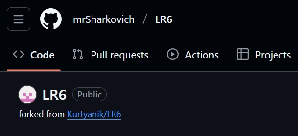
### После установки настроить клиент git, введя имя пользователя и email
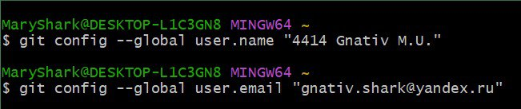
### Клонировать свой личный удалённый репозиторий на компьютер
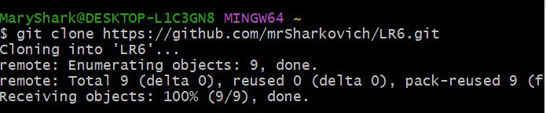
### Добавить файл через интерфейс GitHub. Подтянуть изменения в локальный репозиторий
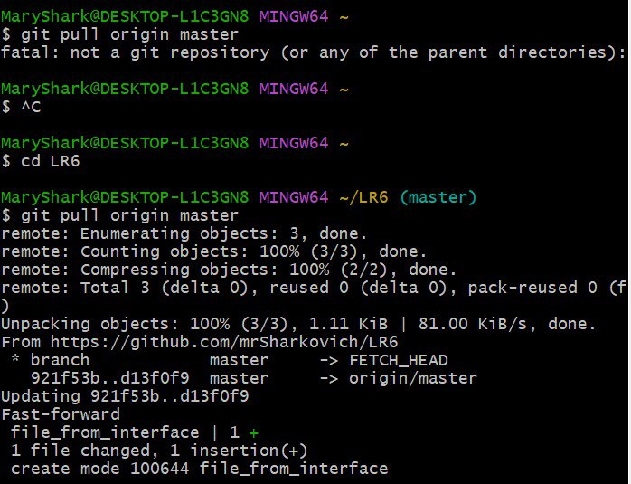
### Получить историю операций для каждой из веток
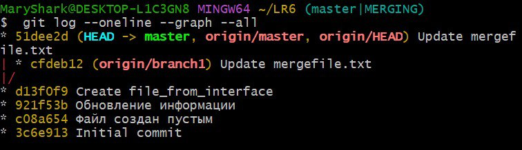
### Просмотреть последние изменения
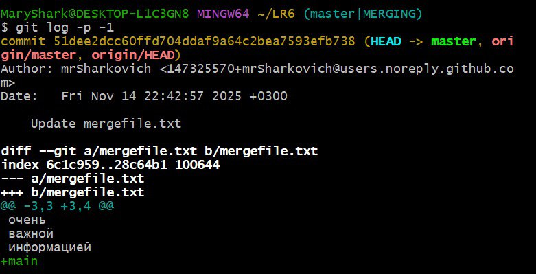
### Выполнить слияние в ветку master, разрешив конфликт
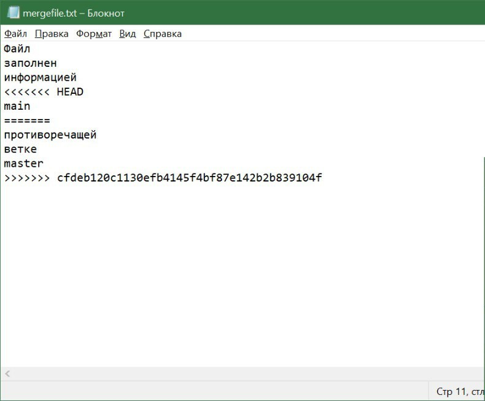
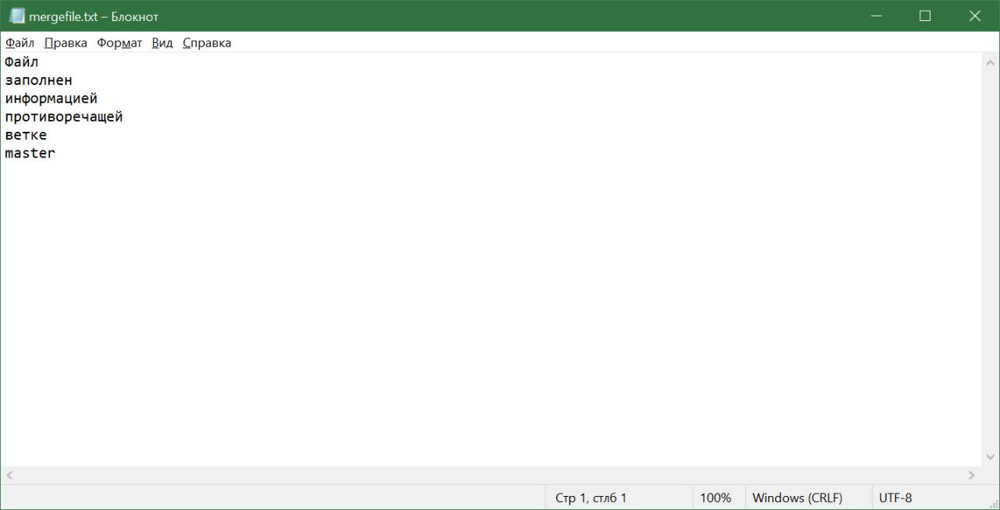
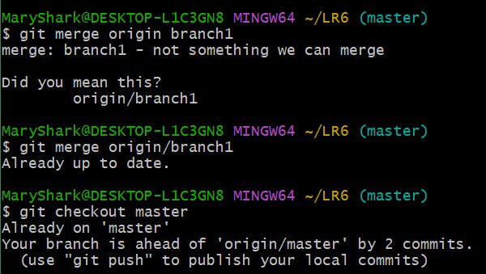
### Удалить побочную ветку после успешного слияния
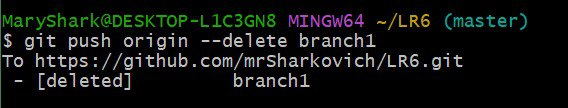
### Сделать изменения и зафиксировать их, оставляя комментарии, несколько раз
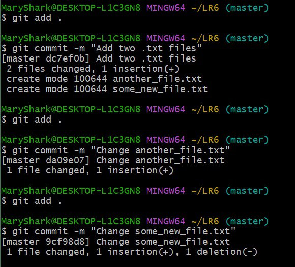
### Сделать откат коммита
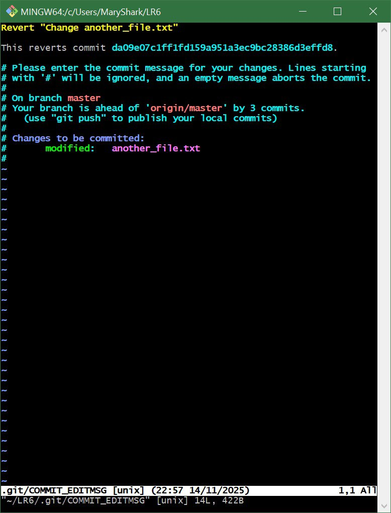
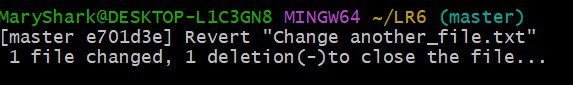
### Создать ветку для отчёта
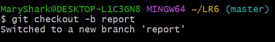
### Начать оформлять отчёт в файле README.md, используя markdown синтаксис
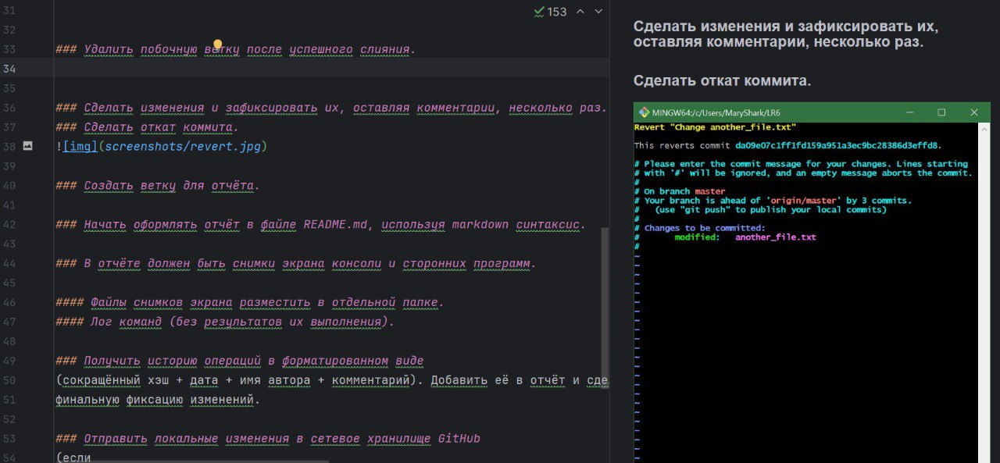
#### Файлы снимков экрана разместить в отдельной папке
Файлы раземещены в папке screenshots.
#### Лог команд
+ git config --global user.name 
+ git config --global user.email 
+ git clone
+ git pull
+ git log --oneline --graph --all
+ git log -p -1
+ git merge
+ git checkout 
+ git add
+ git commit
+ git status
+ git push
+ git push origin --delete
+ git log --oneline
+ git revert (открылся VIM)
+ git log --pretty=format:"%h %ad %an %s" --date=short
+ 
### Получить историю операций в форматированном виде, добавить её в отчёт и сделать финальную фиксацию изменений.
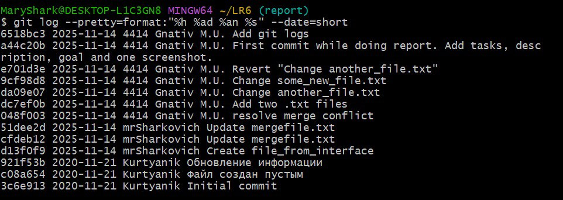

## **Вывод**
В ходе работы были изучены базовые возможности системы управления версиями, был получен опыт работы с Git Api, с локальным и удаленным репозиторием.